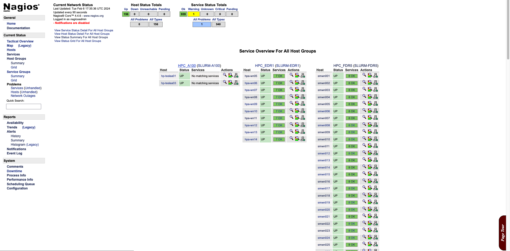
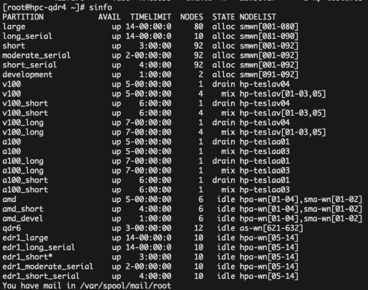

# 陳侑廷 (Rudy Chen) 
- 中央研究院物理研究所 研究助理
- Education: 實踐大學 / 資訊科技與管理
- E-mail: tp953505@gmail.com
- Hi! I'm Rudy Chen 陳侑廷，現職中研院研究助理。
- 擅長溝通合作，做事謹慎且細心，邏輯清晰，具換位思考能力，富有挑戰精神，追求自我成長。

### 作品集
  - 建置Nagios  
     
  - 建置Slurm  
     
  - 部署至各機器的shell script 程式
    ( deploy.sh / transfer_data.sh)
  - 收集網路數據資料的python 程式
    ( zeek_to_hadoop.py / prometheus_to _local.py / calculate_test / load_test )
  - Nagios檢查各服務的shell script程式
    ( nagios_plugins )

